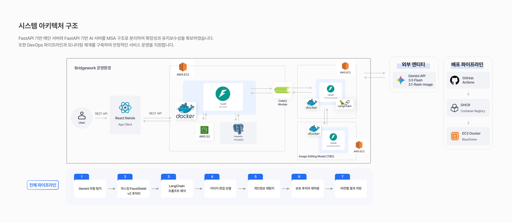
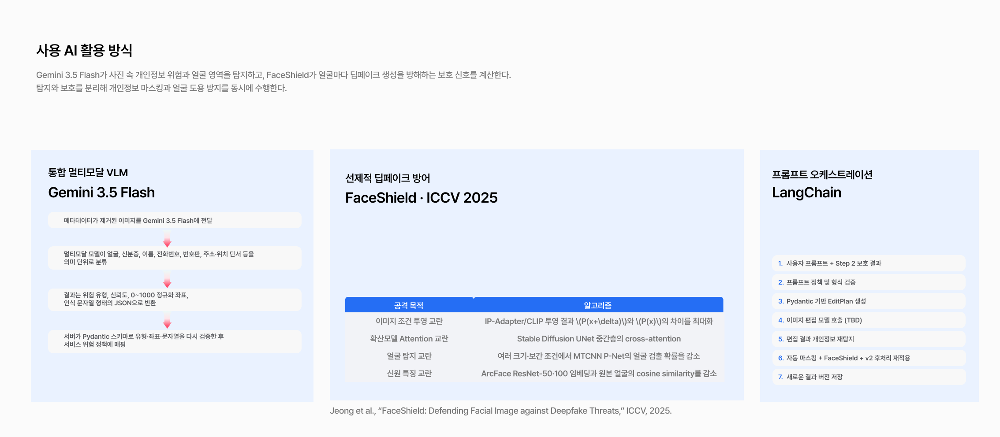
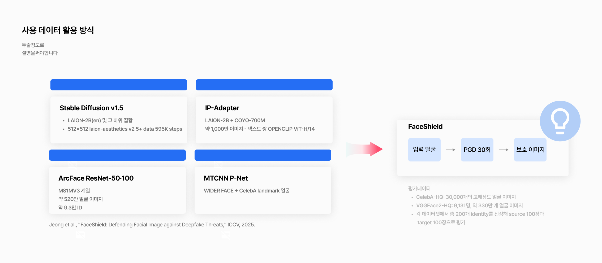
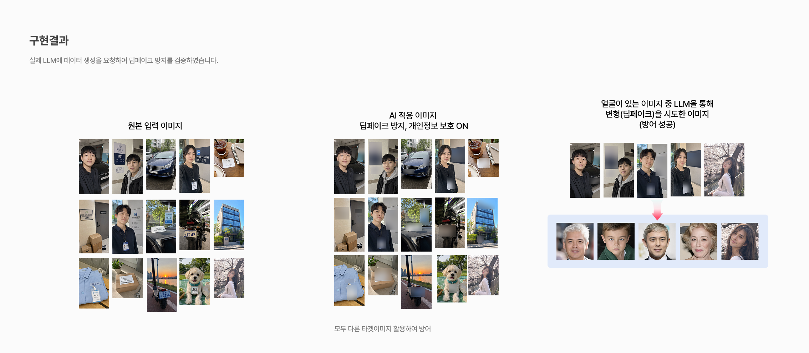
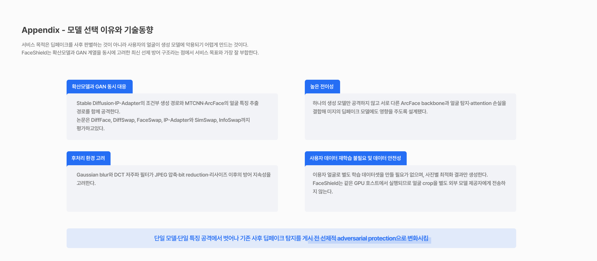

# Preveil AI Server

백엔드가 전달한 이미지에서 개인정보 노출 위험을 분석하고, 사용자가 선택한 영역을 블러한 뒤 얼굴에 FaceShield 보호를 적용하는 AI 서버.

| 컴포넌트 | 역할 |
|-----------|------|
| **aiserver** (FastAPI) | 이미지 분석·보호 REST API, 요청 검증 및 처리 조율 |
| **Gemini** | 얼굴·신분증·번호판·문자·위치 단서 등 시각 위험요소 탐지 |
| **EXIF 검사** | GPS 메타데이터 탐지, 방향 정규화 및 이미지 지문 생성 |
| **OpenCV** | 사용자가 선택한 polygon 영역 블러 |
| **FaceShield** | 탐지된 얼굴에 딥페이크 방지 perturbation 적용 |
| **Object Storage** | Presigned GET/PUT URL을 통한 원본 다운로드·결과 업로드 |

- **로컬 서버:** `http://localhost:8000` · Swagger: [/docs](http://localhost:8000/docs) · OpenAPI: [/openapi.json](http://localhost:8000/openapi.json)
- **API 명세:** [공통 규칙](.agents/docs/api/common.md) · [이미지 분석](.agents/docs/api/images-analyze.md) · [이미지 처리](.agents/docs/api/images-process.md)
- **설계·운영 문서:** [AI 아키텍처](.agents/docs/ai_architect.md) · [배포](.agents/docs/deployment.md)

## 아키텍처

[](images/system-architecture.png)

```
[Backend Worker] --REST--> [AI Server :8001] --vision analysis--> [Gemini API]
       |                          |
       |                          +--selected polygons--> [OpenCV Blur]
       |                          +--detected faces-----> [FaceShield GPU CLI]
       |                          |
       +-------- [Object Storage] <---Presigned GET/PUT---+
```

플로우: 백엔드가 Presigned GET URL로 `/analyze` 요청 → AI 서버가 이미지를 내려받아 EXIF 방향을 정규화하고 Gemini 분석 + 로컬 EXIF 검사를 수행 → 위험 그룹, 탐지 좌표, 이미지 지문 반환 → 사용자가 영역을 선택하면 백엔드가 `/process` 요청 → 원본 지문 검증 및 얼굴 재탐지 → 선택 영역 블러 + 얼굴 FaceShield 보호 → 메타데이터 정책을 적용한 PNG를 Presigned PUT URL로 업로드.

AI 서버는 분석 상태나 이미지 파일을 영구 저장하지 않는다. `/process`는 `/analyze`의 서버 상태에 의존하지 않으며, 얼굴 여부를 확인하기 위해 Gemini 분석을 다시 수행한다.

## AI 및 데이터 활용 방식

<table>
  <tr>
    <td width="50%" align="center" valign="top">
      <a href="images/ai-usage.png">
        
      </a><br>
      <sub><b>AI 활용 방식</b><br>위험 탐지, 딥페이크 선제 방어, 프롬프트 오케스트레이션</sub>
    </td>
    <td width="50%" align="center" valign="top">
      <a href="images/data-usage.png">
        
      </a><br>
      <sub><b>데이터 활용 방식</b><br>FaceShield 구성 모델의 학습 데이터와 평가 흐름</sub>
    </td>
  </tr>
</table>

## 구현 결과 및 모델 선택

<table>
  <tr>
    <td width="50%" align="center" valign="top">
      <a href="images/implementation-results.png">
        
      </a><br>
      <sub><b>구현 결과</b><br>개인정보 마스킹과 얼굴 딥페이크 방어 적용 예시</sub>
    </td>
    <td width="50%" align="center" valign="top">
      <a href="images/model-selection-and-trends.png">
        
      </a><br>
      <sub><b>모델 선택 이유</b><br>공격 범위, 전이성, 후처리 내성, 데이터 안전성 기준</sub>
    </td>
  </tr>
</table>

> 각 이미지를 클릭하면 원본 크기로 확인할 수 있습니다.

## 개발 환경

요구사항: [uv](https://docs.astral.sh/uv/), Python 3.12. 전체 얼굴 보호 기능에는 NVIDIA CUDA GPU와 별도로 설치한 FaceShield Python 3.8 conda 환경이 필요하다.

```bash
uv sync --dev                 # 의존성 설치
cp .env.example .env          # 환경변수 준비
# ALLOWED_STORAGE_HOSTS, GEMINI_API_KEY 등을 실제 환경에 맞게 설정
uv run uvicorn app.main:app --env-file .env --reload --host 0.0.0.0 --port 8000
```

```bash
uv run ruff check .           # 린트
uv run ruff format --check .  # 포맷 검사
uv run pytest                 # 단위 테스트 (외부 API·스토리지·GPU 불필요)
```

주요 환경변수는 [.env.example](.env.example)에 정리되어 있다. `ALLOWED_STORAGE_HOSTS`에는 scheme이나 경로 없이 허용할 Object Storage 호스트명을 쉼표로 구분해 입력한다. path-style S3 URL을 사용하면 `STORAGE_BUCKET`도 설정한다.

### 컨테이너 실행

```bash
docker build -t aiserver1:local .
docker run --rm --env-file .env -p 8001:8000 aiserver1:local
```

현재 이미지는 FastAPI CPU 런타임만 포함한다. `/health`, `/analyze`, 얼굴이 없는 `/process`는 검증할 수 있지만, 얼굴이 탐지된 `/process`는 별도의 FaceShield conda/CUDA 런타임 없이는 `DEEPFAKE_PROTECTION_FAILED`로 종료된다. 전체 기능은 GPU 호스트에서 API 프로세스가 `FACESHIELD_REPO_PATH`의 공식 저장소와 `FACESHIELD_COMMAND`를 통해 별도 FaceShield 환경을 호출하도록 구성한다.

## Ping 테스트 / API 사용 명령어

`BASE`를 실행 환경에 맞게 설정한다. 로컬 Python 실행은 `http://localhost:8000`, 위 컨테이너 예시는 `http://localhost:8001`이다.

```bash
BASE=http://localhost:8000

# 0) 서버 living 확인 (ping)
curl -s "$BASE/health"
# → {"status":"ok"}

# 백엔드가 발급한 HTTPS Presigned URL과 실제 객체 키를 준비
SOURCE_KEY='original/2026/07/image-123.jpg'
SOURCE_URL='https://example-bucket.s3.ap-northeast-2.amazonaws.com/original/2026/07/image-123.jpg?X-Amz-...'

# 1) 이미지 분석 (정적 JPEG/PNG/WebP, 기본 제한 10MB·4096×4096)
curl -s -X POST "$BASE/api/v1/images/analyze" \
  -H "Content-Type: application/json" \
  -d "{
    \"source_object_key\": \"$SOURCE_KEY\",
    \"source_download_url\": \"$SOURCE_URL\"
  }"
# → request_id, image.sha256, risk_groups, detections 반환

# 2) 이미지 처리 — SHA256은 1번 응답의 image.sha256을 그대로 사용
RESULT_KEY='protected/2026/07/image-123.png'
RESULT_URL='https://example-bucket.s3.ap-northeast-2.amazonaws.com/protected/2026/07/image-123.png?X-Amz-...'
ANALYSIS_SHA256='<64자리 image.sha256>'

curl -s -X POST "$BASE/api/v1/images/process" \
  -H "Content-Type: application/json" \
  -d "{
    \"source_object_key\": \"$SOURCE_KEY\",
    \"source_download_url\": \"$SOURCE_URL\",
    \"result_object_key\": \"$RESULT_KEY\",
    \"result_upload_url\": \"$RESULT_URL\",
    \"result_content_type\": \"image/png\",
    \"analysis_image_sha256\": \"$ANALYSIS_SHA256\",
    \"selected_regions\": [
      {
        \"detection_id\": \"det_vehicle_license_plate_001\",
        \"risk_group\": \"VEHICLE\",
        \"polygon\": [[820,750],[1100,750],[1100,840],[820,840]]
      }
    ],
    \"remove_metadata\": true
  }"
# → {"request_id":"...","status":"COMPLETED",...,"result_content_type":"image/png"}
```

`selected_regions`가 빈 배열이면 영역 블러 없이 얼굴 보호와 메타데이터 정책만 적용한다. 얼굴 보호는 사용자 선택과 무관하게 자동 수행된다. 성공한 `/process` 응답은 이미지 바이트가 아니라 업로드 완료 정보이며, 결과 파일은 `result_object_key`에 저장된다.

에러 응답 형식: `{"error":{"code":"...","message":"...","request_id":"..."}}` — 전체 상태·오류 코드는 [이미지 분석 명세](.agents/docs/api/images-analyze.md#오류-응답)와 [이미지 처리 명세](.agents/docs/api/images-process.md#오류-응답)를 참조한다.

## CI/CD

`.github/workflows/cicd.yml` — 관련 코드 경로의 main 브랜치 push / PR 및 수동 실행 시 동작:

1. **quality** — ruff 린트/포맷 + pytest
2. **container** — amd64/arm64 이미지를 빌드하고 main push 시 `ghcr.io/tech4good-one-t/aiserver`에 `latest` + `sha-<commit>` 태그로 게시
3. **deploy** — GitHub OIDC → AWS SSM으로 EC2에 immutable digest 이미지를 배포하고 `/health` 검증

**deploy Repository variables:**

| 이름 | 값 |
|------|-----|
| `AWS_ROLE_ARN` | GitHub OIDC로 assume할 IAM Role ARN (필수) |
| `EC2_INSTANCE_ID` | 배포 대상 EC2 인스턴스 ID (필수) |
| `AWS_REGION` | AWS 리전 (선택, 기본 `ap-northeast-2`) |
| `APP_PORT` | 호스트 공개 포트 (선택, 기본 `8001`) |

EC2에는 Docker, AWS CLI, SSM Agent와 `/opt/aiserver1/.env`가 필요하다. 현재 컨테이너 자동 배포는 FaceShield 런타임을 포함하지 않으므로, 얼굴 보호까지 필요한 GPU 호스트 구성은 [배포 문서](.agents/docs/deployment.md)의 별도 런타임 절차를 따른다.

## 디렉토리 구조

```
├── app/
│   ├── api/             # FastAPI 라우트, 요청·응답 스키마, 의존성
│   ├── core/            # 환경설정, 오류 응답, HTTP·로깅 공통 처리
│   └── services/        # Gemini, FaceShield, 이미지 I/O·가공, 위험 정책
├── deploy/              # EC2 컨테이너 배포 스크립트
├── infra/               # AWS OIDC/IAM/SSM 및 EC2 부트스트랩
├── images/              # 아키텍처, AI·데이터 활용, 구현 결과 장표
├── .agents/docs/        # API 계약, 아키텍처, 로깅·테스트·배포 문서
├── .github/workflows/   # CI/CD 워크플로
└── tests/               # pytest 단위·API 테스트
```

## 보안 / 운영 주의사항

- **Presigned URL, 이미지, OCR 원문, EXIF/GPS 값은 절대 로깅 금지** — URL 쿼리에는 임시 서명이 포함된다.
- `GEMINI_API_KEY`는 `.env` 또는 접근이 제한된 운영 환경 파일에만 저장하고 Git, 로그, 메신저에 남기지 않는다.
- URL은 HTTPS, 허용 호스트·버킷, 객체 키 일치 여부를 검증하며 리다이렉트를 허용하지 않는다. AI 서버에 S3 장기 자격증명을 제공하지 않는다.
- 이미지 픽셀은 분석을 위해 Google Gemini API에 전송된다. 실제 개인정보 처리 전 이용자 고지·동의와 사용 계정의 최신 데이터 처리 조건을 확인한다.
- FaceShield는 얼굴이 탐지되면 필수다. 설정 누락·실패·타임아웃 시 보호되지 않은 이미지를 업로드하지 않고 요청을 실패 처리한다.
- API 계약을 변경하면 `.agents/docs/api/` 문서와 백엔드 연동 명세를 함께 갱신하고 담당자에게 공유한다.
